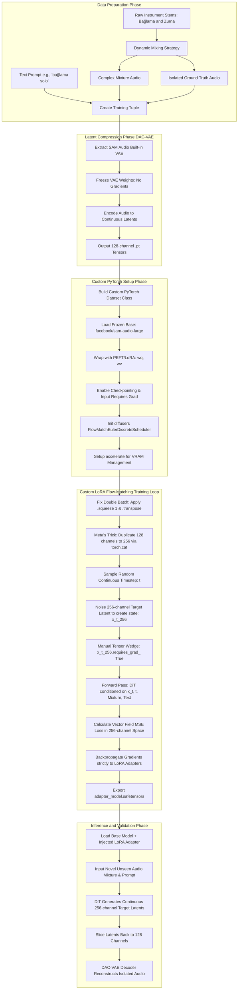

# Turkish Music Instrument Segmentation

```mermaid
flowchart TD

    subgraph Data Preparation Phase
        RawStems[Raw Instrument Stems: Bağlama and Zurna] --> DynamicMix[Dynamic Mixing Strategy]
        DynamicMix --> MixtureAudio[Complex Mixture Audio]
        DynamicMix --> TargetAudio[Isolated Ground Truth Audio]
        Prompt[Text Prompt e.g., 'bağlama solo'] --> Tuple[Create Training Tuple]
        MixtureAudio --> Tuple
        TargetAudio --> Tuple
    end

    subgraph Latent Compression Phase DAC-VAE
        Tuple --> LoadVAE[Extract SAM Audio Built-in VAE]
        LoadVAE --> FreezeVAE[Freeze VAE Weights: No Gradients]
        FreezeVAE --> EncodeLatents[Encode Audio to Continuous Latents]
        EncodeLatents --> LatentTensors[Output 128-channel .pt Tensors]
    end

    subgraph Custom PyTorch Setup Phase
        LatentTensors --> CustomDataset[Build Custom PyTorch Dataset Class]
        CustomDataset --> LoadBase[Load Frozen Base: facebook/sam-audio-large]
        LoadBase --> InjectLoRA[Wrap with PEFT/LoRA: wq, wv]
        InjectLoRA --> EnableGrads[Enable Checkpointing & Input Requires Grad]
        EnableGrads --> LoadScheduler[Init diffusers FlowMatchEulerDiscreteScheduler]
        LoadScheduler --> Accelerate[Setup accelerate for VRAM Management]
    end

    subgraph Custom LoRA Flow-Matching Training Loop
        Accelerate --> SqueezeBatch[Fix Double Batch: Apply .squeeze 1 & .transpose]
        SqueezeBatch --> MetaTrick[Meta's Trick: Duplicate 128 channels to 256 via torch.cat]
        MetaTrick --> TimeSample[Sample Random Continuous Timestep: t]
        TimeSample --> AddNoise[Noise 256-channel Target Latent to create state: x_t_256]
        AddNoise --> ManualWedge[Manual Tensor Wedge: x_t_256.requires_grad_ True]
        ManualWedge --> ForwardPass[Forward Pass: DiT conditioned on x_t, t, Mixture, Text]
        ForwardPass --> CalcLoss[Calculate Vector Field MSE Loss in 256-channel Space]
        CalcLoss --> Backprop[Backpropagate Gradients strictly to LoRA Adapters]
        Backprop --> SaveAdapter[Export adapter_model.safetensors]
    end

    subgraph Inference and Validation Phase
        SaveAdapter --> DeployModel[Load Base Model + Injected LoRA Adapter]
        DeployModel --> InputNovel[Input Novel Unseen Audio Mixture & Prompt]
        InputNovel --> DiTSeparation[DiT Generates Continuous 256-channel Target Latents]
        DiTSeparation --> SliceLatents[Slice Latents Back to 128 Channels]
        SliceLatents --> DecodeAudio[DAC-VAE Decoder Reconstructs Isolated Audio]
    end
```
